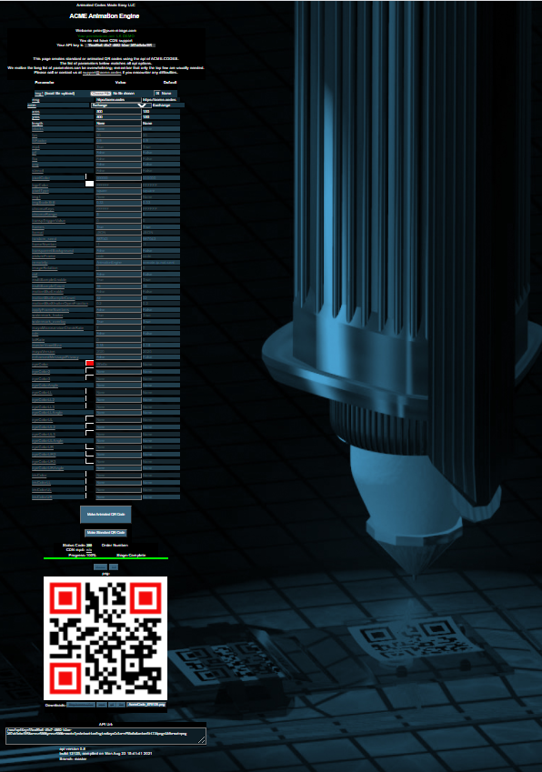

.. |br| raw:: html

    

AnimationEngine
###############

The Animation Engine is an interactive web page available to subscribers only. It supports generation of animated codes and standard codes with full access to all parameters without have to code or learn a programming language. There is a link to it from the api top url of api.acme.codes. This page can also be helpful to learning developers as the API calls used to create animated and standard code are displayed as individual codes are made.

`https://api.acme.codes/AnimationEngine <https://api.acme.codes/AnimationEngine>`_
|br|
|br|
|br|

