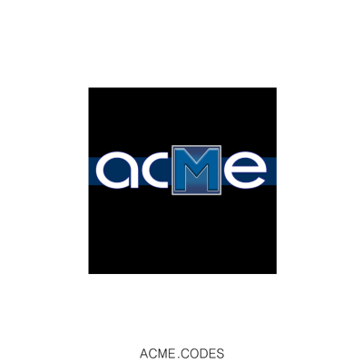

.. |br| raw:: html

    

Examples
########

Here are Rest call sequence examples to generate an Animated QR code through ACME's API.

1. Basic Animation
2. Custom Image Anim
3. Standard QR code (not animated, free within volume limitations)

** See our SDK for working Python and Javascript examples of code using our API. **

Basic
"""""

Here is the minimal 2 step request sequence to receive an animated code from api.acme.codes:

GET: ``/new`` |br|
GET: ``/orders/<#>/mp4``

1. ``/new`` |br| Request an order number by http GET method /new, and receive `JSON <https://en.wikipedia.org/wiki/JSON>`_ response from the ACME service containing an **Order Number**.
|br|
|br|
2. ``/orders/#/mp4`` |br| Request the product (or any other information) by http GET method referencing the **Order Number**. 

For example, a requesting service could ask for an animation to be started by:
::

    GET: https://api.acme.codes/new?msg=ReadingAcmeDocumentationIsFun!

ACME service would return JSON:
::

    {"orderNumber": "1444720642_NLGEDCVP"}
    
Now, after some time has passed, the client can retrieve up to 5 different animated products: gif, mp4, fbx, png (single frames), and zip (raw aggregated frames). For example, an mp4 movie file can be attained by:
::

    GET: https://api.acme.codes/orders/1444720642_NLGEDCVP/mp4

ACME service would then return an animated requested file type. Depending on creation arguments described in this documentation, a file similar to this mp4 would be returned:

.. raw:: html 

   <video loop autoplay muted src="./_static/BasicDemo.mp4"></video> 

Note: An immediate resource GET request to an accurate order will initially result in a '202 Accepted' response, and not a '200 OK' return code because the service has not yet completed creating the file. This response page will contain a message clarifying the reason for the temporary inability to return the requested file.
|br| |br|
Important reminder: Make sure to copy your animations down and place them in your app or `CDN <https://en.wikipedia.org/wiki/Content_delivery_network>`_ or data storage soon after you create them. Do not put links of the animations you create on api.acme.codes in your apps or CDNs; they will soon be deleted. The animations are only available off of api.acme.codes temporarily; older ``/orders`` are automatically deleted over time. Please remember your harvest period for all files you create on api.acme.codes is limited.
|br|
|br|
OR
|br|
|br|
If you become a monthly subscriber, ACME offers its own CDN as supported by Microsoft Azure. This ACME feature supports global, secure, 24/7/365 hosting of your animation files. See the `CDN section <https://acme.readthedocs.io/en/latest/CDN.html>`_ of this documentation and the ``cdn=`` argument of the ``/new`` resource for details. 
|br|
|br|

This completes the Basic Animation workflow; The "Animation with Image" workflow details how to avoid the '202 Accepted' response entirely.

Custom Image
""""""""""""

Most users of ACME's API want custom images applied to their generated animations. Th workflow below shows how to do this.
Also, since ACME animation generation times can vary significantly based on animation complexity (sub-second to > 2 minutes), this more standard transaction sequence described below provides more options to a client application.

GET: ``/new?startOnOrderCreation=0`` |br|
POST: ``/orders/<#>/image`` |br|
GET: ``/orders/<#>/progress`` |br|
GET: ``/orders/<#>/mp4`` |br|

1. ``/new?startOnOrderCreation=0`` |br|
(Required for Custom Image Integration) |br|
Create the new order but suppress animation creation with startOnOrderCreation=0. Animation will start after below image upload call.
|br|
|br|
2. ``/orders/<order number>/image`` |br|
(Required for Custom Image Integration) |br|
Upload an image to the specific order just created. This starts the animation creation process.
|br|
|br|
3. ``/orders/<order number>/progress`` |br|
(Required) |br|
Iteratively GET the **server-side runtime information and order progress** of the animation generation by referencing the **Order Number**. This can be used to display a real time progress bar feedback window for the client. When progress is 100%, the final mp4 URL is also returned.
|br|
|br|
4. ``/orders/<order number>/frames/1`` |br|
(Optional, rarely used) |br|
GET the **first frame** (or any frame, with reasonable correlation to the known server-side progress) by referencing the **Order Number**. This can be used to provide accurate visual feedback to the client user of the product as it is being made. Then, when the server-side progress is = 100%:
|br|
|br|
5. ``/orders/<order number>/mp4-file-info`` |br|
(Optional, rarely used) |br|
GET the final product file size. This information can be used below.
|br|
|br|
6. Retrieve the final mp4 animation. |br|
(Required) |br|
This can be done in two ways: |br|
``/orders/<order number>/mp4`` |br| GET the final product (animation, 3d file, frames, etc.) with the genericly named ``/mp4`` resource, or |br|
``<Final url provided in above progress resource>`` |br| GET the final mp4 with a specific file URL returned in the above ``progress`` resource when progress is 100%. |br|
|br|

7. Measure |br|
(Optional, rarely used) |br|
Measure the local file size as it is streamed in from the above call and compare it to the known full file size. This comparison can be used to accurately provide visual progress bar(s) to the client regarding file transmission.

8. Retrieve by CDN |br|
(Optional) |br| If paying for ACME Content Delivery Network (CDN) subscription, use the URL supplied in the JSON response from step 1 which contains an absolute path to the hosted animation files. See the `CDN section <https://acme.readthedocs.io/en/latest/CDN.html>`_ of this documentation for details.

Below are specific detailed examples of the above process.

1. New: For example, a client application could:
::

    GET: https://api.acme.codes/new?startOnOrderCreation=0&msg=ReadingAcmeDocumentationIsFun!

ACME service would return JSON:
::

    {"orderNumber": "1444720642_NLGEDCVP"}

2. Image: Now the users local custom image must be uploaded:
::

    POST: https://api.acme.codes/orders/1444720642_NLGEDCVP/image

The above call will received the image and initiate the animation creation process. ACME service would return JSON:
::

    200 OK

3. Progress: Optionally, now the client application can iteratively retrieve the server-side order progress:
::

    GET: https://api.acme.codes/orders/1444720642_NLGEDCVP/progress

ACME service would return JSON:
::

    {"progress": 12, "queue": 0}

The client can repeatedly request the progress resource (every few seconds or so) until the "progress" key is 100, indicating that the order is complete. Also, if the "queue" value is non zero, this indicates the service resources are at their maximum capacity since a queue has formed, indicating a slowdown in the usual turnaround time. This can be communicated to the user to help explain slow or temporarily static progress values.|br|
Most importantly, when progress is 100 and mp4 file was requested, a URL is provided targeting a specific mp4 file available on the server for download or display:
::

    {"progress": 100, "queue": 0, "mp4": "https://api.acme.codes/orders/1595107770_1EGWU128/AcmeCode_441535.mp4"}

4. Frames: Optionally (and rarely used), the remote client application can retrieve arbitrary frames as they become available. Here are 3 examples of specific frames being requested:
::

    GET: https://api.acme.codes/orders/1444720642_NLGEDCVP/frames/1

ACME service would return a non-animated single png file of frame 1:

.. image:: ./_static/AcmeFrame_1.png

::

    GET: https://api.acme.codes/orders/1444720642_NLGEDCVP/frames/90

ACME service would return a non-animated single png file of frame 90:

.. image:: ./_static/AcmeFrame_90.png

::

    GET: https://api.acme.codes/orders/1444720642_NLGEDCVP/frames/120

ACME service would return a non-animated single png file of frame 120:

5. Size: Optionally, and rarely used, when reported server-side order "progress" is 100%, the client application can request the final product file size:
::

    GET https://api.acme.codes/orders/1444720642_NLGEDCVP/mp4-file-info

ACME service would return JSON:
::

    {"fileSize": 439441}

6. Animation: Finally, the client application can retrieve the completed animated products. ACME's API generates the following products: mp4, gif, png frames, fbx and zip. The most common retrieval is the mp4 file of an animation, which is best retrieved from the "mp4" data returned from the "progress" resource when progress has completed at 100. The "mp4" value contains a specific URL and filename for retrieval:
::

    GET: https://api.acme.codes/orders/1595107770_1EGWU128/AcmeCode_441535.mp4

Alternatively, the mp4 can retrieved from a non-specific, or generic resource:
::

    GET: https://api.acme.codes/orders/1444720642_NLGEDCVP/mp4

In either case, ACME service would then return an animated mp4 file. Depending on creation arguments described below, a file similar to this would be returned:

.. raw:: html

   <video loop autoplay muted src="./_static/BasicDemo.mp4"></video>

Optionally, and rarely used, the client application can display the transmission progress of the final product as it is streamed from server to client by querying the size of the local streamed file as it arrives and comparing it to the known full file size from the above optional mp4-file-info resource.
|br|
|br|
Important reminder: Make sure to copy your animations down and place them in your app or `CDN <https://en.wikipedia.org/wiki/Content_delivery_network>`_ or data storage soon after you create them. Do not put links of the animations you create on api.acme.codes in your apps or CDNs; they will soon be deleted. The animations are only available off of api.acme.codes temporarily; they are automatically deleted over time. Please remember your harvest period for all files you create on api.acme.codes is limited.
|br|
|br|
OR
|br|
|br|
Optionally, if paying for ACME Content Delivery Network subscription, use the URL supplied in the JSON response from step 1 which contains an absolute path to the hosted animation files:

::

    {"orderNumber": "1576574190_8Z0U08JD", "cdnMp4": "https://cdn.api.acme.codes/2019/12/17/e4983b0f-3688-48c1-a49a-f92bda5fb703/AcmeCode_283150.mp4"}

This location can then be embedded in any web page html with global high reliability and availability:

::

   <video loop autoplay muted src="https://cdn.api.acme.codes/2019/12/17/e4983b0f-3688-48c1-a49a-f92bda5fb703/AcmeCode_283150.mp4"></video>

See the `CDN section <https://acme.readthedocs.io/en/latest/CDN.html>`_ of this documentation for details.

Standard QR Codes
"""""""""""""""""

Sometimes folks want to use ACME's API to generate standard QR codes that are not animated. Why? Several features such as color control, tile shape, transparency, stenciling, anti-aliasing, rotation, and resolution are more controllable than other online standard (non-animated) QR code generation services.

Also, standard QR Codes are free.

(Within reasonable request volume limitations)

To clarify: Though encoded messages are wrapped in free use demo mode *for animations*, standard QR code embedded messages are not wrapped, and have the direct original message embedded in the code. In other words, animated QR codes are paywalled, while standard, non-animated, QR codes are completely free and without message wrapping.

Click `here <./new.html>`_ to see all the options for QR code generation, in particular people like to use the `pixelType <./new.html#pixeltype>`_ argument to customize the code tile shapes of standard QR Codes.

There are two methods to getting free standard QR codes form ACME's API:

1. The :ref:`Acme Sequence`, which is 2-3 API calls. This is the best API approach if you think you may want animated QR codes in the future, your code will already be able to handle the longer generation times required for animated code creation and avoid any timeout problems.
|br|
|br|
2. :ref:`Single Call` sequence. With certain arguments, ACME's API will return a PNG file directly as a response to the first creation API call.

.. _Acme Sequence:

Acme Sequence
Here is the 'most ACME way' to do a multi-step request sequence to receive a standard (non-animated) code from api.acme.codes:

1. ``/new?anim=Still&msg=Hello!`` |br| Request an order number by http GET method /new and specify a non-animated product, and receive `JSON <https://en.wikipedia.org/wiki/JSON>`_ response from the ACME service containing an **Order Number** .
|br|
|br|
2. ``/orders/#/frames/1`` |br| Request the standard PNG file by http GET method referencing the **Order Number**.

For example, a requesting service could ask for code by:
::

    GET: https://api.acme.codes/new?msg=Hello&anim=Still

ACME service would return JSON:
::

    {"orderNumber": "1444720642_NLGEDCVP"}

Now, almost immediately, the client can retrieve a standard PNG file:
::

    GET: https://api.acme.codes/orders/1444720642_NLGEDCVP/frames/1

ACME service would then return a png file:

.. image:: ./_static/AcmeFrame_1.png

Note: An immediate resource GET request to an accurate order *might* initially result in a '202 Accepted' response, and not a '200 OK' return code because the service has not yet completed creating the file. For non-animated requests like this, it is not usually required to query and order's progress because the creation time is so short. However, it is still good practice to check and retry if a 202 response is initially returned.
|br| |br|

.. _Single Call:

Single Call
By setting *both* ``anim=Still`` and ``format=png``, api.acme.codes will directly return a PNG file of a standard QR code. Note: Due to our high quality rendering pipeline, turnaround time varies and may require a few seconds before return. Contact ``sales@acme.codes`` if you require faster response times for standard QR code creation API calls, which are available.
::

    GET: https://api.acme.codes/new?msg=Hi!&anim=Still&format=png

