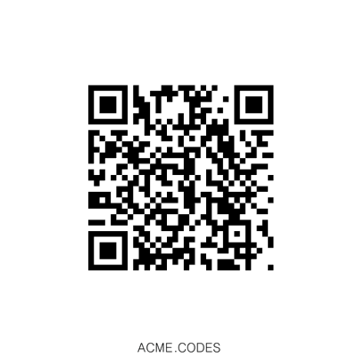

.. |br| raw:: html

    

Non-animated Codes
##################

Sometimes folks want to use ACME's API to generate standard QR codes that are not animated. Why? Several features such as color control, transparency, anti-aliasing, rotation, and resolution are more controllable than other online standard (non-animated) code generation services.

Also, standard QR Codes are free!

To clarify: Though encoded messages are wrapped in free use demo mode *for animations*, static (non-animated) code embedded messages are not wrapped, and have the direct original message embedded in the code. In other words, animated QR codes are paywalled, while standard, non-animated, QR codes are completely free and without message wrapping.

There are two methods to getting free standard QR codes form ACME's API:

1. The ACME **Standard Call Sequence**, which is 2-3 api calls. This is the best API approach if you think you may want animated QR codes in the future, your code will already be able to handle the longer generation times required for animated code creation and avoid any timeout problems.
|br|
|br|
2. **Single Call Request**. With certain arguments, ACME's api will return a png file directly as a response to the first creation API call. 

**Standard Call Sequence:**
Here is the best 2-step request sequence to receive a standard (non-animated) code from api.acme.codes:

1. /new?anim=staticCodeOnly&msg=Hello! |br| Request an order number by http GET method /new and specify a non-animated product, and receive `JSON <https://en.wikipedia.org/wiki/JSON>`_ response from the ACME service containing an **Order Number** .
|br|
|br|
2. orders/#/frames/1 |br| Request the static png file by http GET method referencing the **Order Number**. 

For example, a requesting service could ask for code by:
::

    GET: https://api.acme.codes/new?msg=Hello&anim=staticCodeOnly

ACME service would return JSON:
::

    {"orderNumber": "1444720642_NLGEDCVP"}
    
Now, almost immediately, the client can retrieve a static non animated png file:
::

    GET: https://api.acme.codes/orders/1444720642_NLGEDCVP/frames/1

ACME service would then return a png file:

Note: An immediate resource GET request to an accurate order *might* initially result in a '202 Accepted' response, and not a '200 OK' return code because the service has not yet completed creating the file. For non-animated requests like this, it is not usually required to query and order's progress because the creation time is so short. However, it is still good practice to check and retry if a 202 response is initially returned.
|br| |br|

**Single Call Request:**

The following API call will directly return a png file of a standard QR code. Note: Due to our high quality rendering pipeline, turnaround time varies and may require a few seconds before return. Contact ACME.CODES if you require faster response times for standard QR code creation API calls, which are available. 
::

    GET: https://api.acme.codes/new?msg=Hi!&anim=staticCodeOnly&format=png

Important reminder: Make sure to copy your animations down and place them in your app or `CDN <https://en.wikipedia.org/wiki/Content_delivery_network>`_ or data storage soon after you create them. Do not put links of the animations you create on api.acme.codes in your apps or CDNs; they will soon be deleted. The animations are only available off of api.acme.codes temporarily, though generally always available for 48 hours after creation. They are automatically deleted over time. Please remember your harvest period for all files you create on api.acme.codes is limited.
