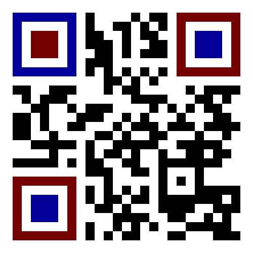
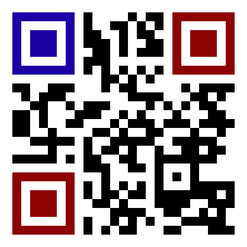
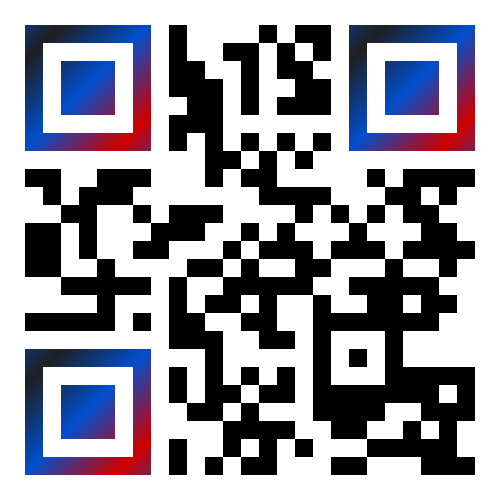

.. |br| raw:: html

    

Parameters
##########

.. _parameters:

A call to the ``/new`` endpoint starts the creation process of a code.

The parameters listed below on this page affect QR code creation and **are all optional**.

Learning about the details of the list below is not required; each parameter can be learned over time as the developer or user needs more advanced features.

In fact, it is valid to call ``/new`` with no parameters at all and still get a dynamically generated mp4 file of an animated QR code:

Example:
::

    GET: https://api.acme.codes/new

Example return value:
::

    {"orderNumber": "1629840132_5BFTHUTO", "mp4": "https://api.acme.codes/orders/1629840132_5BFTHUTO/AcmeCode_810589.mp4"}

|br|

**For Animated QR codes, the most commonly used parameters are:** |br|

Message: ``msg=`` |br|
Resolution: ``xres=``, ``yres=`` |br|
Custom images ``ufile=`` |br|
Animation ``anim=`` |br|
|br|
|br|
**For Standard QR codes, the most commonly used parameters are:** |br|

Format ``format=png`` (Required) |br|
Message: ``msg=`` |br|
Resolution: ``xres=``, ``yres=`` |br|
Custom images ``ufile=`` |br|
|br|
|br|
For example, a user wanting an animated QR code could send a request for: |br|
|br|
1. A larger resolution mp4 file |br|
2. of the 'Spin' Animation |br|
3. with an embedded message for a product purchase page on their website |br|
4. using an image from their website of the product being sold |br|
|br|

with the following call:
|br|
|br|
``https://api.acme.codes/new?msg=https://myWebsite.com/productPurchasePage20&xres=1000&yres=1000&anim=Spin&img1=https://myWebsite.com/images/product20.jpg``
|br|
|br|
|br|
|br|
|br|
For another example, a user wanting a Standard QR code could send a request for: |br|
|br|
1. A specific resolution png file |br|
2. with an embedded message for a product purchase page on their website |br|
|br|

with the following call:
|br|
|br|
``https://api.acme.codes/new?msg=https://myWebsite.com/productPurchasePage20&xres=1000&yres=1000&format=png``
|br|
|br|
|br|
|br|
|br|

All creation parameters are listed below in alphabetical order and can be applied to the ``/new`` endpoint to influence code creation.

.. _apiKey:

apiKey
------

First, it's important to remember that sending a value for the ``apiKey`` parameter is optional; we do this so any developer can learn, experiment with, and integrate the API at any time. See the SDK section of this documentation for working examples to be used by anyone. Of course, if no ``apiKey`` parameter is supplied, the service will watermark the custom portions of the animation and limit the embedded message to a demo page that proves the message can be put into the code by our API, but limits any practical use of the code.
|br|
|br|
To generate animated codes without watermarking and without message demo wrapping, a valid `API Key <https://en.wikipedia.org/wiki/Application_programming_interface_key>`_ associated with a paid subscription to ACME.CODES must be submitted in this parameter. Contact sales@acme.codes to be given a temporary "try-it-out" API key or purchase a permanent API Key for completely unlocked codes.

.. _anim:

anim
----

The animation to be applied to the code. See ``/anims`` and ``anims/<animName>`` resources for a complete list of valid values for anim. Default = 'Exchange'.

.. _applyFrameNumbers:

applyFrameNumbers
-----------------

This setting allows for diagnostic per frame overlays of a frame hand and frame count to ensure altered animations are rendered correctly for expected total and block times.

.. _bgpColor:

bgpColor
--------

Background Plate Color. Background color. Default = '``FFFFFF``' (White). In the future, multiple hex color values can be supplied separated by commas for multi color gradations. Green background example: ``https://api.acme.codes/new?bgpColor=00FF00``

.. _bitRate:

bitRate
-------

Bitrate parameter for encoding mp4 files. Defines the target bitrate for the mp4 streaming encoder. Default is 0; when set to 0, allows the mp4 encoder to adjust the bitrate as can be best for the animation. When explicitly set, the higher this number, the higher the quality of the delivered mp4 file, as well as the larger the mp4 file size. Example to create a higher than normal fidelity mp4 file: ``https://api.acme.codes/new?bitRate=1200``

.. _blocks:

blocks
------

One of ACME's most popular parameters for refining generated animations to preference. For any given animation, ``blocks=`` allows for arbitrary timing of the blocked portions of the animation. Each animation has default block timing; for example, the block timing of a code to image and back animation would be 2 seconds of the code, two seconds animating to the image, 2 second hold of the image, and finally 2 second animation back to the code. (Note: the last two seconds are so 'minus the last frame' in order to support smooth looping transitions.) ``blocks=`` allows for overriding of any animation's default block timing. |br| |br| So, say an animation is wanted that instead animates the code display for one second, then animates to the image in 5 seconds, then holds the image for 2 seconds, then animates back to the code in 3 seconds. With the block parameter comma separated values representing the absolute times for blocks to start and stop, the needed parameter would be ``blocks=0-1,1-6,6-8,8-11``. All values are in seconds, not frames. |br| |br| Float values fully supported: ``0-2.44,2.44-6`` is ok. |br| |br| It is important to note some animations have only one block (Spin for example), while others usually have 4, and still others have overlapping animation block times. Default block values are given with the ``/anims/<animName>`` resource. ``blocks`` values are also subjected to the ``length`` parameter.
   

.. _cdn:

cdn
---

For subscribers paying for CDN services only, this parameter flags the request for animation files to be automatically uploaded to our Cloud Service Provider. Default value is 0. When set to 1/True, generated animation product files will be uploaded to a dynamically determined subdirectory of one of ACME's CDN endpoint domains. See the `CDN section <https://acme.readthedocs.io/en/latest/CDN.html>`_ of this documentation for more details. Note this parameter must be accompanied with an apiKey associated with a CDN subscription account enabled by ACME.

For example, a subscriber who as paid for CDN services can call:

``https://api.acme.codes/new?cdn=1&apiKey=<yourApiKeyHere>&gif=0&fbx=0&msg=helloFromAcme``

which will generate a response with the additional information of the location of where the published animation files will be available after ``progress`` is 100:

``{"orderNumber": "1576574190_8Z0U000D", "cdnMp4": "https://cdn.api.acme.codes/2019/12/17/e4983b0f-3688-48c1-a49a-f9345a5fb703/AcmeCode_283150.mp4"}``

.. _chromaRange:

chromaRange
-----------

Supports the breadth of color range to be used in chromaKeys arg. Default value is 5.

.. _EyeColors:

EyeColors
---------

Custom colors are supported for the QR code 'eyes'; the three visually prominent registration anchors in the corners of all QR codes. The parameters below support unique colors for the eyes as distinct from the color defined by the 'pixelColor' parameter.

Some examples of using eyeColor and the other related options below:

.. _eyeColor:

eyeColor
~~~~~~~~

Gives all eyes the same unique color as from the color of the rest of the QR code.

Example: ``/new?eyeColor=ff0000``

.. _eyeColorLL:

eyeColorLL
~~~~~~~~~~

A custom color for the lower left eye, layered on top of the value for the eyeColor parameter, if any.

.. _eyeColorUL:

eyeColorUL
~~~~~~~~~~

A custom color for the upper left eye, layered on top of the value for the eyeColor parameter, if any.

.. _eyeColorUR:

eyeColorUR
~~~~~~~~~~

A custom color for the upper right eye, layered on top of the value for the eyeColor parameter, if any.

.. _eyeColor2:

eyeColor2
~~~~~~~~~

A second color defining a color gradient to be applied to all eyes. If defined along with eyeColor, a gradient color tone will be made from eyeColor to eyeColor2 for all eyes.

.. _eyeColor3:

eyeColor3
~~~~~~~~~

A third color defining a color gradient to be applied to all eyes. If defined along with eyeColor and eyeColor2, a gradient color tone will be made from eyeColor to eyeColor2 to eyeColor3 for all eyes.

.. _eyeColorAngle:

eyeColorAngle
~~~~~~~~~~~~~

The angle of the gradient pattern applied to eyes when eyeColor2, or both eyeColor2 and eyeColor3 are defined.

.. _eyeColorLL2:

eyeColorLL2
~~~~~~~~~~~

A second color defining a color gradient to be applied only to the lower left eye.

.. _eyeColorLL3:

eyeColorLL3
~~~~~~~~~~~

A third color defining a color gradient to be applied only to the lower left eye.

.. _eyeColorLLAngle:

eyeColorLLAngle
~~~~~~~~~~~~~~~

The angle of the gradient pattern applied to the lower left eye when its associated eyeColor2, or both eyeColor2 and eyeColor3 are defined.

.. _eyeColorUL2:

eyeColorUL2
~~~~~~~~~~~

A second color defining a color gradient to be applied only to the upper left eye.

.. _eyeColorUL3:

eyeColorUL3
~~~~~~~~~~~

A third color defining a color gradient to be applied only to the upper left eye.

.. _eyeColorULAngle:

eyeColorULAngle
~~~~~~~~~~~~~~~

The angle of the gradient pattern applied to the upper left eye when its associated eyeColor2, or both eyeColor2 and eyeColor3 are defined.

.. _eyeColorUR2:

eyeColorUR2
~~~~~~~~~~~

A second color defining a color gradient to be applied only to the upper right eye.

.. _eyeColorUR3:

eyeColorUR3
~~~~~~~~~~~

A third color defining a color gradient to be applied only to the upper right eye.

.. _eyeColorURAngle:

eyeColorURAngle
~~~~~~~~~~~~~~~

The angle of the gradient pattern applied to the upper right eye when its associated eyeColor2, or both eyeColor2 and eyeColor3 are defined.

.. _irisColor:

irisColor
~~~~~~~~~

The color to be applied to the central square 'iris' of all eyes, distinct from the eyeColor. Ignored if color gradients are defined.

.. _irisColorLL:

irisColorLL
~~~~~~~~~~~

The color to be applied to the central square of the lower left eye, distinct from the eyeColor. Ignored if color gradients are defined.

.. _irisColorUL:

irisColorUL
~~~~~~~~~~~

The color to be applied to the central square of the upper left eye, distinct from the eyeColor. Ignored if color gradients are defined.

.. _irisColorUR:

irisColorUR
~~~~~~~~~~~

The color to be applied to the central square of the upper right eye, distinct from the eyeColor. Ignored if color gradients are defined.

fbx
---

Create an `FBX <https://en.wikipedia.org/wiki/FBX>`_ file, one of the 3d industry's open file format options, loadable in many different 3d applications such as `Autodesk Maya <https://en.wikipedia.org/wiki/Autodesk_Maya>`_, and the open source solution `Blender <https://www.blender.org>`_. Default=True

.. _fitFactor:

fitFactor
---------

This controls the fraction of the framed code which fills the camera view. If set to a low values close to `` 0 `` , the code will be very small in the frame, while if set to 1, the code will touch the borders. Note that some animations will alter the default fitFactor to ensure all of the animation is properly viewable, but explicit setting of fitFactor will override animation influences. Default is ``fitFactor=0.9``

.. _format:

format
------

The desired format of the return value. Default = 'JSON'. Usually format is left undeclared in order inherit the default 'JSON'. Animated QR codes take time to make, so the JSON response provides information to make follow up calls to query the state of creation, and ultimately the final animation as an mp4 file. Typical JSON response would look like

``{"orderNumber": "1631327815_Z5V5M2U0", "mp4": "https://api.acme.codes/orders/1631327815_Z5V5M2U0/AcmeCode_826882.mp4"}``

With the above information, progress checks can be made with calls to

``https://api.acme.codes/orders/1631327815_Z5V5M2U0/progress``

and when responses to progress indicate the animation creation has reached 100%, retrieve the completed mp4 file at the specificed mp4 location.

However, two other options exist: 'png', and the rarely used 'html'.
|br|
|br|
The 'png' format option is used to retrieve a direct response of an image file in png format. Since image files can be made very quickly, direct responses are possible.
|br|
|br|
The 'html' option exists for people interacting and learning about the ACME API with a browser, and will return an html web page containing a clickable link to the final order products. This can be useful for interactive demonstration, testing, and verification of the API directly without relying on a more complex GUI front end. Without the 'html' option and without a front end, the user is left to parse raw JSON and manually assemble the URL, which is not fun for anything but scripts.
|br|
|br|
Examples: |br|
``https://api.acme.codes/new?format=JSON`` (Default) |br| |br|
``https://api.acme.codes/new?format=html`` (Simple html page for workflow education) |br| |br|
``https://api.acme.codes/new?format=png``  (Parameter for direct single png image return) |br| |br|

.. _fps:

fps
---

Another one of ACME's popular settings; Frames Per Second. All animations are defined in terms of time, so any animation can be rendered at any industry standard FPS while maintaining the same animation timing. The higher the FPS, the higher the 'look and feel' of the smoothness of the animation. At the time of this document's writing, the ACME default is 15FPS, but this will soon shift to 30FPS. Control over FPS can have significant effect over final animation file size, in particular gif files.

.. _frameNumber:

frameNumber
-----------

Limits the generation of the animation to one specific frame. Use of this is discouraged for normal use. Normal access of individual frames should be through the /orders/[Order#]/frames/[n] resource. However, if the user is creating test suites or similar use cases where it is known in advance that only one frame is needed, it can be helpful to use this parameter to optimize test execution time by limiting generated output to just one frame.

.. _frames:

frames
------

Create rendered frames file. Default=True. Required for most usage. By turning off, delivery times for fbx files is reduced, which is helpful for people wanting only digital 3d files.

.. _gif:

gif
---

Create gif file. Default=True. Note gif generation requires the longest processing time of all other creation processes.

.. _imageRotation:

imageRotation
-------------

The rotation to be applied to a supplied image URL.
Example:
``https://api.acme.codes/new?anim=Spin&img1=https://api.acme.codes/images/tests/img1.png&imageRotation=90``

.. _imgScaleStill:

imgScaleStill
-------------

If an image is given in a post call to create a standard non-animated QR code, this parameter allows for arbitrary scaling
of the image within the QR code. Note some mild image distortion might occur as the image dimensions must
be forced to snap to borders of the QR code.
Example:

``https://api.acme.codes/new?format=png&imgScaleStill=0.4``

.. _img1derp:

img1
----

One of two ways to supply an image to be integrated within the animation, if supported by the selected animation.
The parameter of ``img1=`` must be a URL to an image published online.
Example
``https://api.acme.codes/new?anim=Spin&img1=https://api.acme.codes/images/tests/img1.png``
See the more standard use of POSTing an image with the `ufile <#uderp>`_ parameter.
Note if an image is supplied to a standard (non animated) QR code generation request, the image is placed in the middle of the code. Also, make sure your image complies with our supported input `Formats <Formats.html#input>`_ .

.. _length:

length
------

Length, in seconds, to constrain or expand the animation time length. So, if a default animation's time is 4 seconds, using ``length=2`` or ``length=10`` can be used to customize and shorten or extend the length of the animation. Length is applied on top of - but still respecting the relative values of - the ``blocks`` parameter. Think of of the  ``length`` parameter as stretching or shrinking any explicitly defined or default values of the block timing. Default value of ``length`` is specific to each animation, and can be derived from the last value of the default ``blocks`` value in ``/anims/<animName>``.

.. _mp4:

mp4
---

Create mp4 file. Default=True

.. _msg:

msg
---

The message to be encoded into the code. Default = 'https://acme.codes'

Examples:

``https://api.acme.codes/new?msg=GreetingsCustomer!``
``https://api.acme.codes/new?msg=https://www.your.website/aPageToBuyProductAFrom.html``
``https://api.acme.codes/new?msg=ThisIsABitcoinHashJustBetweenYouAndMe``
``https://api.acme.codes/new?msg=Product1234567890``

.. _multiSampleEnable:

multiSampleEnable
-----------------

Also known in the industry as anti-aliasing, this setting improves the edge smoothness for high contrast borders that are at an angle. The 'jaggies', or staircase-like outline of simple renderings of angled edges are smoothed by sampling (measuring / calculating) multiple times the expected tonal within each pixel. Though this can slow down frame creation time, today's hardware GPU powered rendering (including ACME's default renderer), any slowdown is negligible per frame, but can add up to measurable amounts when multiplied over many frames to be rendered in an animation. Default is on.

.. _multiSampleCount:

multiSampleCount
----------------

If ``multiSampleEnable`` is on, this setting controls the number of additional samples to be made per pixel. Default is 32, the highest available. 

.. _motionBlurEnable:

motionBlurEnable
----------------

Motion blur is one of the corner stones of quality animations; if an object is moving quickly within a single frame, it needs to look blurry with the motion as would be expected by any image capturing device. Without motion blur, animations or video have an unnatural 'crisp', or 'sharp' feel. And, like most quality improving features, slows down creation time substantially. Some customers prefer the crisp feel, so this setting allows for control of motion blur. Default is ``motionBlurEnable=True``, though some animations default to disabling it without an explicit override.

.. _motionBlurSampleCount:

motionBlurSampleCount
---------------------

This controls the number of samples taking for applying motion blur per frame. Default is ``motionBlurSampleCount=32``

.. _motionBlurShutterOpenFraction:

motionBlurShutterOpenFraction
-----------------------------

This controls the fraction of a frame that the renderer's virtual camera shutter is open. ``0`` = shutter is never open, while ``1`` = shutter is open the entire frame. Default is ``motionBlurShutterOpenFraction=0.2``

.. _pictureFrame:

pictureFrame
------------

For animations combining both a scannable code and a provided image, ``pictureFrame`` allows control over the scaling of the image or the code to be within the confines of the other. Specifically, if ``pictureFrame=code``, then the image is scaled in the animation to be within the boundaries of the code. If ``pictureFrame=image``, the code is scaled in the animation to be within the boundaries of the image. Default: ``pictureFrame=code``.

.. _pixelColor:

pixelColor
----------

The color of the base code tiles in hex. Default = ``'000000'`` (Black). Multiple hex color values can be supplied separated by commas for multi color options. Red pixel example: ``https://api.acme.codes/new?pixelColor=FF0000``

.. _pixelType:

pixelType
---------

Shape of the pixels (or "tiles") to use in QR codes. Valid set: ['square', 'circle'] Default = square. ``https://api.acme.codes/new?pixelType=circle&xres=500&yres=500``

Result:

.. _random_seed:

random_seed
-----------

Many animations available to clients contain certain randomized elements in the final animations. Explicitly setting randomSeed allows for these randomized elements to be consistent for the client for any given code. This parameter also allows for consistent results in our automated test systems. ``https://api.acme.codes/new?random_seed=5``

.. _remoteIp:

remoteIp
--------

Intermediary front-end web pages, apps, or automated API's can send (and are sometimes required to send) the IP address of the remote client through this parameter. ``https://api.acme.codes/new?remoteIp=123.456.789.1``

.. _stencil:

stencil
-------

Stencil option; rather than create a positive pattern of dark tiles on a **white background** to form the code, create the negative pattern of white tiles against a **transparent background** to form the code (complete with white border frame), `like a stencil <https://en.wikipedia.org/wiki/Stencil>`_ . This allows for a client to use the resulting animation as an overlay to a custom darker image, animation, or video. |br| |br| Care must be taken to ensure the code is still scannable in these conditions; since final scannability is only determinable on the client side, scannability with this option is fully the responsibility of the client. Also, unless and until the stencil version of the animated code is actually on top of a dark background, the initial delivery will be functionally invisible when viewed against the white default of browser backgrounds. Default = false |br| Example: ``https://api.acme.codes/new?stencil=true``

.. _transparentBackground:

transparentBackground
---------------------

Removes the background plane and allows for full transparency. Note transparency is only supported in gif file formats. This parameter is used in conjunction with the ``stencil`` parameter, in some cases automatically.

.. _transpTriggerValue:

transpTriggerValue
------------------

Single byte hex defined value (00-ff) which determines the transparency amount when a portion of the uploaded image is determined to be fully transparent. This is a rarely used fine tuning option for the Exchange and a few other animations.

.. _uderp:

ufile
-----

One of two ways - and the preferred way - to have a custom image integrated into an animation for animations supporting images. The binary image can be ``POST`` ed as the parameter along with all other creation parameters normally associated with ``GET``. See `SDK examples <SDK+Postman.html>`_ for working example web pages and/or code. Note if an image is supplied to a standard (non animated) QR code generation request, the image is placed in the middle of the code. See `img1 <#img1derp>`_ parameter for an alternative image parameter option. Also, make sure your image complies with our supported input `Formats <Formats.html#input>`_ .

.. _xres:

xres
----

X Resolution, or Pixel Width, of the generated animation. Note if this value is not in harmony with yres, cropping can occur in the final product. Default = ``150`` |br|
Example:
``https://api.acme.codes/new?xres=500&yres=500``

.. _yres:

yres
----

Y Resolution, or Pixel Height, of the generated animation. Note if this value is not in harmony with xres, cropping can occur in the final product. Default = ``150`` |br|
Example:
``https://api.acme.codes/new?xres=500&yres=500``

|br|
|br|
|br|
|br|
|br|
|br|
|br|
|br|
|br|
|br|
|br|
|br|
|br|
|br|
|br|
|br|
|br|
|br|
|br|
|br|

