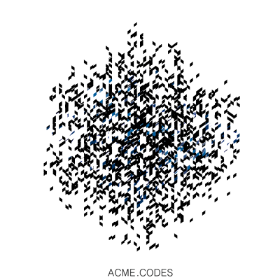

.. |br| raw:: html

    

Standard Request
################

Since ACME animation generation times can vary significantly based on animation complexity (sub-second to > 2 minutes), the more standard transaction sequence described below provides more options to a client application. 

1. Initiate a new animation creation by GETing a new order by calling https://api.acme.codes/new, and receive JSON response containing an **Order Number**. See the documentation on /new for details on the many arguments that define your requested animation. 
2. (Optional) Iteratively GET the **server-side runtime information and order progress** of the animation generation by referencing the **Order Number**. This can be used to display a real time progress bar feedback window for the client. Then, when the server side progress is > 5%:
3. (Optional) GET the **first frame** (or any frame, with reasonable correlation to the known server-side progress) by referencing the **Order Number**. This can be used to provide accurate visual feedback to the client user of the product as it is being made. Then, when the server-side progress is = 100%:
4. (Optional) GET the final product file size. This information can be used below.
5. GET the final product (animation, 3d file, frames, etc.)
6. (Optional) Measure the local file size as it is streamed in from the above call and compare it to the known full file size. This comparison can be used to accurately provide visual progress bar(s) to the client regarding file transmission.

New Order
"""""""""

For example, a client application could:
::

    GET: https://api.acme.codes/new?msg=ReadingAcmeDocumentationIsFun!

ACME service would return JSON:
::

    {"orderNumber": "1444720642_NLGEDCVP"}
    
Progress
""""""""

Optionally, now the client application can iteratively retrieve the server-side order progress:
::

    GET: https://api.acme.codes/orders/1444720642_NLGEDCVP/progress

ACME service would return JSON:
::

    {"progress": 12, "queue": 0}
    
The client can repeatedly request the progress resource (every few seconds or so) until the "progress" key is 100, indicating that the order is complete. Also, if the "queue" value is non zero, this indicates the service resources are at their maximum capacity since a queue has formed, indicating a slowdown in the usual turnaround time. This can be communicated to the user to help explain slow or temporarily static progress values.

Frames
""""""

Optionally, the remote client application can retrieve arbitrary frames as they become available. Here are 3 examples of specific frames being requested: 
::
    
    GET: https://api.acme.codes/orders/1444720642_NLGEDCVP/frames/1

ACME service would return a non-animated single png file of frame 1:

::
    
    GET: https://api.acme.codes/orders/1444720642_NLGEDCVP/frames/90

ACME service would return a non-animated single png file of frame 90:

::
    
    GET: https://api.acme.codes/orders/1444720642_NLGEDCVP/frames/120

ACME service would return a non-animated single png file of frame 120:

Size
""""
    
Optionally, when reported server-side order "progress" is 100%, the client application can request the final product file size:
::

    GET https://api.acme.codes/orders/1444720642_NLGEDCVP/mp4-file-info

ACME service would return JSON:
::

    {"fileSize": 439441}

Animation
"""""""""

Finally, the client application can retrieve the completed animated products. ACME's API generates the following products: mp4, gif, png frames, fbx and zip. The most common retrieval is the mp4 file of an animation, which can be attained with the mp4 order resource:
::

    GET: https://api.acme.codes/orders/1444720642_NLGEDCVP/mp4

ACME service would then return an animated mp4 file. Depending on creation arguments described below, a file similar to this would be returned:

.. raw:: html 

   <video loop autoplay muted src="./_static/BasicDemo.mp4"></video> 

Optionally, the client application can display the transmission progress of the final product as it is streamed from server to client by querying the size of the local streamed file as it arrives and comparing it to the known full file size from the above optional mp4-file-info resource.
