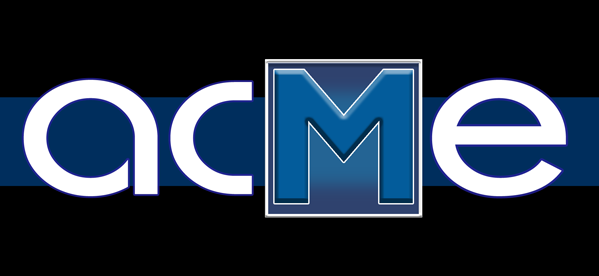

api.acme.codes ReST documentation
=================================

================
Introduction
================

This documentation describes the `REST <https://en.wikipedia.org/wiki/Representational_state_transfer>`_ ful `Web Application Programming Interface <https://en.wikipedia.org/wiki/Web_API>`_ (Web API) supporting the  `'Software as a Service' (SaaS) <https://en.wikipedia.org/wiki/Software_as_a_service>`_ provided by `Animated Codes Made Easy LLC <https://www.acme.codes>`_, or 'ACME'. 

ACME's service at https://api.acme.codes provides near real time creation of customized animations of any scannable code, including QR codes. Standard codes and QR codes (non-animated) can also be created.

If you are a software developer interested in using ACME's service, this documentation is for you. If you are not a software developer, you'll probably be happier visiting ACME's home page: `www.acme.codes <http://www.acme.codes>`_, or you may just want to go ahead and make animated codes yourself with `ACME's Coderunner <https://coderunner.acme.codes>`_ .

This documentation describes the ReST API call sequences for requesting an animated code online. 

The API described in this documentation is available at `https://api.acme.codes <https://api.acme.codes>`_

The example workflows described in this documentation will function for anyone; in particular non-animated codes can be generated without any payment (for free). However messages embedded into *animated* codes will be prefixed to ACME's website in a way that limits commercial use but still demonstrates ACME's real time encoding ability. All generated demonstration codes are scannable, however the embedded link will only affirm the requested test message rather than contain the original message. To encode messages into animated codes without this prefixed demonstration restriction, a subscription-based business agreement with ACME must first be paid for.

The majority of API calls made available here can be experimented with by anyone with a browser. Simply try the links directly, or copy, edit, and paste them to create your own test codes.

If you have feedback or questions on this documentation, or if you are interested in purchasing bulk quantity near real time animated codes or QR codes through ACME's API, please contact `sales@acme.codes <mailto:sales@acme.codes?subject=From%20RTD:%20Interest%20in%20ACME%20Web%20Service>`_  

Certain design and architectural features of this service are patented under `US 10,083,535 B2 <https://patents.google.com/patent/US10083535B2>`_.

'QR Code' is a registered trademark of DENSO WAVE INCORPORATED
   
   
.. toctree::
   :maxdepth: 2
   :caption: Contents:

   Basic Animation
   Standard Animation
   Non-animated Codes
   animations
   fbx
   frames
   gif
   mp4
   new
   orders
   progress
   price-list
   thumbnails
   version

Indices and tables
==================

* :ref:`genindex`
* :ref:`search`
